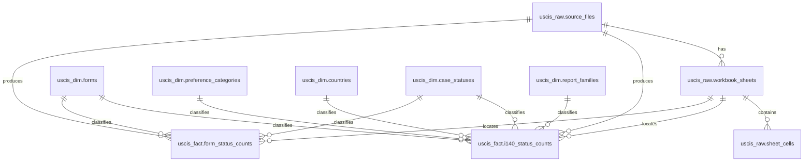

# USCIS Analysis Database Schema

This project loads manually collected USCIS files into the local PostgreSQL database `uscis_analysis`.

The database is split into four schemas:

- `uscis_raw`: source file registry and raw workbook/PDF/CSV extraction trace.
- `uscis_dim`: lookup/dimension tables for forms, countries, statuses, report families, and I-140 preference categories.
- `uscis_fact`: normalized numerical facts extracted from the source files.
- `uscis_mart`: analysis-ready views.

## Current Loaded State

Last verified local load:

| Object | Row count |
|---|---:|
| `uscis_raw.source_files` | 79 |
| `uscis_raw.workbook_sheets` | 155 |
| `uscis_raw.sheet_cells` | 119,329 |
| `uscis_dim.forms` | 143 |
| `uscis_dim.countries` | 17 |
| `uscis_fact.i140_status_counts` | 30,434 |
| `uscis_fact.form_status_counts` | 7,589 |

Local raw file folder:

`C:\Users\kelav\OneDrive\Документы\projects\uscis_analysis\data\raw\raw_by_hands`

Detected local source files in that folder:

| Extension | Count |
|---|---:|
| `.csv` | 54 |
| `.xlsx` | 24 |
| `.pdf` | 45 |

Not every file is loaded as a separate source. If a PDF appears to duplicate a CSV/XLSX with the same normalized name, the parser prefers the structured CSV/XLSX and skips the PDF. Exact duplicate file hashes are also skipped.

## Raw Schema

### `uscis_raw.source_files`

One row per loaded source file.

Important columns:

- `id`: source file primary key.
- `report_family`: logical report type, such as `all_forms`, `fy_quarter_status`, `preference_country`, or `country_category`.
- `file_name`: original local file name.
- `source_url`: local loads use a `local_hand://...` pseudo-URL.
- `local_path`: absolute local path to the parsed file.
- `report_fiscal_year`, `report_quarter`: fiscal year/quarter inferred from the file name.
- `snapshot_date`: current observation date used for analysis. For local files this is currently inferred as the fiscal quarter end date, unless `SNAPSHOT_DATE` is explicitly supplied.
- `file_hash_sha256`: unique content hash.
- `parser_version`, `parse_status`, `parse_notes`: parser metadata.

### `uscis_raw.workbook_sheets`

One row per worksheet, CSV pseudo-sheet, or PDF text pseudo-sheet.

Important columns:

- `source_file_id`: FK to `uscis_raw.source_files`.
- `sheet_name`: worksheet name, `CSV`, or `PDF Text`.
- `sheet_index`: zero-based sheet index.
- `max_row`, `max_column`: extracted shape.
- `detected_table_type`: usually same logical family as `source_files.report_family`.
- `detection_confidence`: coarse parser confidence.

### `uscis_raw.sheet_cells`

Raw extraction audit table.

For XLSX/CSV this stores cell-like values. For PDFs this stores extracted text lines as one-column pseudo-cells.

Important columns:

- `sheet_id`: FK to `uscis_raw.workbook_sheets`.
- `row_num`, `col_num`, `cell_address`: source location.
- `raw_value`, `normalized_value`: original and normalized text.
- `is_merged`, `merged_range`: XLSX merged-cell trace where available.

### `uscis_raw.extraction_corrections`

Reserved table for future manual corrections. It is not the main fact store.

Use this when a parsed value is corrected manually and the reason needs to be recorded.

## Dimension Schema

### `uscis_dim.forms`

Form lookup table.

Examples:

- `I-140`
- `I-130`
- `I-485`
- `TOTAL`

`form_status_counts` can contain many forms. `i140_status_counts` is specifically for I-140 and joins to the `I-140` form row.

### `uscis_dim.preference_categories`

I-140 employment preference/category lookup.

Core categories:

- `TOTAL`
- `EB1`, `E11`, `E12`, `E13`
- `EB2`, `E21`, `NIW`
- `EB3`, `E31`, `E32`, `EW3`
- `OTHER_UNKNOWN`

`parent_category_code` links subcategories to broader EB preference groups.

### `uscis_dim.case_statuses`

Status lookup.

Current statuses:

- `received`
- `approved`
- `denied`
- `pending`
- `pending_other`

Note: USCIS wording differs across reports. `pending_other` is used for labels such as `Pending, Other`.

### `uscis_dim.countries`

Country/aggregate lookup.

`ALL` means All Countries. Other country codes are normalized from USCIS labels and are not guaranteed to be ISO codes.

### `uscis_dim.report_families`

Logical report family lookup.

Current families:

- `all_forms`: service-wide quarterly form counts by form number.
- `fy_quarter_status`: I-140 by fiscal year, quarter, and case status.
- `preference_country`: I-140 receipts/current status by preference and country.
- `country_category`: I-140 receipts or approvals by country and EB category.

## Fact Schema

### `uscis_fact.i140_status_counts`

Main normalized I-140 fact table.

This table stores I-140 facts by:

- source file
- sheet
- EB category
- country
- status
- cohort fiscal year
- cohort quarter, if present
- report fiscal year/quarter
- snapshot date

Important columns:

- `source_file_id`: FK to the source file.
- `sheet_id`: FK to source sheet or pseudo-sheet.
- `form_id`: always I-140 for this fact table.
- `category_id`: EB/I-140 category dimension.
- `country_id`: country or `ALL`.
- `status_id`: received/approved/denied/pending/pending_other.
- `cohort_fiscal_year`, `cohort_quarter`: period the cases belong to.
- `report_fiscal_year`, `report_quarter`: report issue period inferred from file name.
- `snapshot_date`: observation date.
- `count_value`: extracted count.
- `raw_row_label`, `raw_column_label`, `raw_cell_address`: audit trace back to source layout.
- `extraction_method`, `extraction_confidence`, `reviewed`: extraction metadata.

Use this table for I-140 category/country/status analysis.

### `uscis_fact.form_status_counts`

Service-wide all-forms fact table.

This table stores counts for forms such as I-140, I-130, I-485, etc. It is the source for the consistent quarterly I-140 all-forms time series.

Important columns:

- `source_file_id`, `sheet_id`
- `form_id`
- `status_id`
- `report_fiscal_year`, `report_quarter`
- `period_scope`: `quarter` or `ytd`
- `period_quarter`: quarter number for `quarter` rows.
- `count_value`: numeric value. It is numeric rather than integer because all-forms source rows may contain processing-time decimals; the parser stores only count columns, but the table type is flexible.
- `form_category`, `form_description`
- raw source trace and extraction metadata.

Use this table for the broadest 2017-2025 I-140 quarterly series:

- received
- approved
- denied
- pending

## Mart Schema

### `uscis_mart.i140_rates_by_snapshot`

Analysis view over `uscis_fact.i140_status_counts`.

It aggregates rows by source, category, country, cohort period, and snapshot date, then calculates:

- `received`
- `approved`
- `denied`
- `pending`
- `approval_rate_received_basis`: `approved / received`
- `approval_rate_decided_basis`: `approved / (approved + denied)`
- `pending_share`: `pending / received`

This view does not use `form_status_counts`. It is for I-140 category/country reports, not the all-forms service-wide series.

## Relationship Map



## Typical Queries

I-140 quarterly all-forms time series:

```sql
SELECT
    sf.report_fiscal_year AS fy,
    f.period_quarter AS q,
    cs.status_code,
    f.count_value
FROM uscis_fact.form_status_counts f
JOIN uscis_raw.source_files sf ON sf.id = f.source_file_id
JOIN uscis_dim.forms frm ON frm.id = f.form_id
JOIN uscis_dim.case_statuses cs ON cs.id = f.status_id
WHERE sf.report_family = 'all_forms'
  AND frm.form_code = 'I-140'
  AND f.period_scope = 'quarter'
ORDER BY fy, q, cs.status_code;
```

I-140 NIW by country from I-140 fact reports:

```sql
SELECT
    sf.file_name,
    c.country_name,
    cs.status_code,
    f.cohort_fiscal_year,
    f.cohort_quarter,
    f.count_value
FROM uscis_fact.i140_status_counts f
JOIN uscis_raw.source_files sf ON sf.id = f.source_file_id
JOIN uscis_dim.preference_categories pc ON pc.id = f.category_id
JOIN uscis_dim.countries c ON c.id = f.country_id
JOIN uscis_dim.case_statuses cs ON cs.id = f.status_id
WHERE pc.category_code = 'NIW'
ORDER BY sf.report_fiscal_year, sf.report_quarter, c.country_name, cs.status_code;
```

Snapshot rate view:

```sql
SELECT *
FROM uscis_mart.i140_rates_by_snapshot
WHERE category_code = 'NIW'
ORDER BY cohort_fiscal_year, cohort_quarter, snapshot_date;
```
