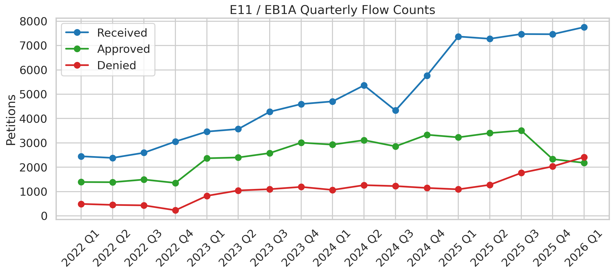
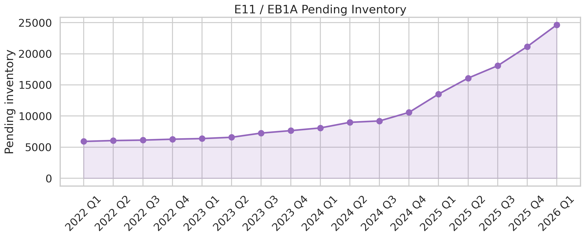
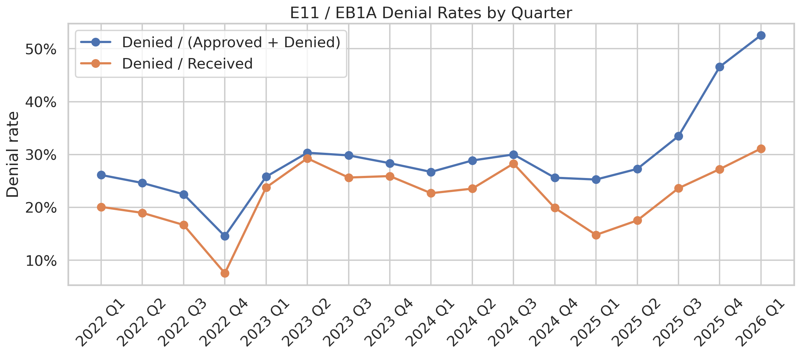
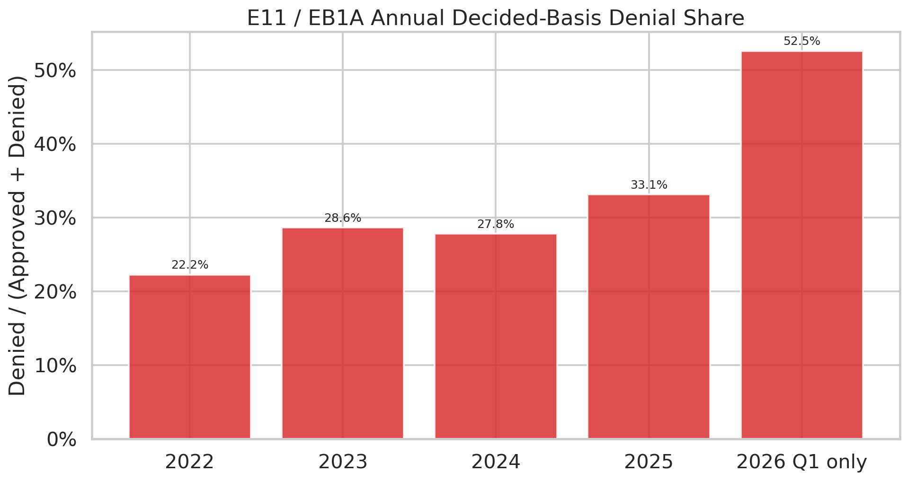
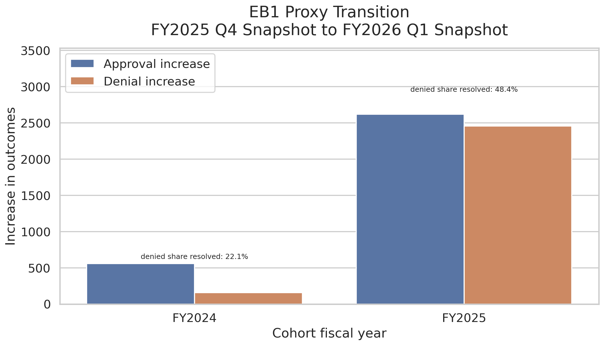
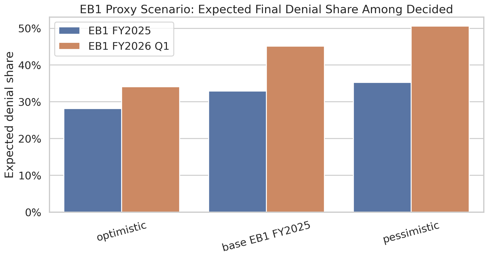

# EB1A / E11 Trend Analysis: Illustrated Report

## Executive Summary

This report summarizes the local USCIS I-140 analysis focused on EB1A / E11. The main question is whether the EB1A adjudication environment worsened in FY2025 and FY2026 Q1, and whether recent pending inventory is likely to resolve into denials at a higher rate than earlier periods.

The evidence is directionally consistent with that hypothesis:

- Direct E11 quarterly data shows weaker approval performance and stronger denial pressure in recent periods.
- The like-for-like Q1 comparison is especially concerning: FY2022-FY2025 Q1 denial/decided is stable near 25-27%, while FY2026 Q1 jumps to 52.5%.
- E11 pending inventory expanded materially through FY2025 and FY2026 Q1.
- Direct E11 pending conversion is not observable, so EB1 is used as a proxy for how pending inventory is resolving.
- The EB1 FY2025 proxy transition from the FY2025 Q4 snapshot to the FY2026 Q1 snapshot is much more negative than the comparable FY2024 transition.

## Research Hypothesis

The working hypothesis is:

1. EB1A / E11 denial pressure increased in FY2025 and became especially visible in FY2026 Q1.
2. Some denials appearing in FY2026 Q1 may correspond to older pending or RFE-affected cases rather than only petitions received in FY2026 Q1.
3. A fall in fast approvals combined with elevated pending inventory may be an early warning signal.
4. FY2025 pending inventory may eventually resolve into denials at a higher rate than earlier historical periods.

The USCIS aggregate files do not contain RFE events, so the RFE mechanism is an interpretation to test indirectly, not an observed fact.

## Data Used

- `data/analysis_tables/eb1eb2_total_radp.csv`
  - Quarterly RADP-style rows for `TOTAL`, `EB1`, `E11`, `EB2`, and `NIW`.
  - Coverage: FY2022 through FY2026 Q1.
  - Main use: direct E11 / EB1A quarterly flow and rate analysis.
- `data/analysis_tables/i140_yearly_total_eb1_eb2_snapshots.csv`
  - Yearly current-status snapshots for `TOTAL`, `EB1`, and `EB2`.
  - Main use: high-level context and EB1 proxy scenario analysis.
- `data/exports/i140_status_counts.csv` plus dimension tables
  - Normalized fact and dimension exports from PostgreSQL.
  - Main use: reconstructing EB1 snapshot-to-snapshot changes.

## Method in Plain Language

The analysis separates three concepts:

- **Received basis:** approvals or denials divided by received petitions. This is useful for workload context but can look artificially weak when many cases are still pending.
- **Decided basis:** approvals or denials divided by `approved + denied`. This better captures adjudication severity among cases that have actually resolved.
- **Pending proxy:** because exact E11 cohort-level pending conversion is not available, EB1 snapshot changes are used cautiously as a proxy.

## Chart-Based Findings

### 1. Direct EB1A flow signal



**Main message:** The direct E11 quarterly series shows that the recent issue is not just volume. Denials become visibly heavier while approvals no longer keep the same relation to receipts.

**Notes:**

- Data source: quarterly RADP-style E11 rows, FY2022 through FY2026 Q1.
- This is the cleanest direct EB1A flow chart currently available in the project.

### 2. Pending inventory becomes part of the story



**Main message:** E11 pending inventory reaches 21,157 at FY2025 Q4 and 24,653 at FY2026 Q1. Fresh periods cannot be read only through approvals and denials because many cases have not resolved yet.

**Notes:**

- Pending is a stock/current-status measure, not a clean same-quarter cohort flow.
- High pending can hide future denials or approvals that will only appear in later USCIS releases.

### 3. Denial rates rise, especially on decided basis



**Main message:** Denied / decided is the clearest severity metric because it compares denials only against resolved outcomes. It avoids treating pending cases as if they were already approvals or denials.

**Notes:**

- Received-basis rates are useful for workload context but are distorted by fresh pending inventory.
- Decided-basis rates are more useful for adjudication severity, though still incomplete for fresh periods.

### 4. Like-for-like Q1 comparison


**Main message:** FY2022-FY2025 Q1 denied/decided is relatively stable: 26.1%, 25.8%, 26.7%, and 25.3%. FY2026 Q1 jumps to 52.5%, while approval/received falls to 28.1%.

**Notes:**

- This is the most intuitive seasonal test: Q1 compared with Q1.
- The expanded baseline makes FY2026 Q1 look abnormal against every available Q1 year, not only FY2024/FY2025.

### 5. Annual E11 denial share



**Main message:** Annual aggregation shows a clear worsening into FY2025, while FY2026 Q1 is much more negative. FY2026 should be read as an early signal, not as a full-year result.

**Notes:**

- FY2026 is Q1 only and must stay visually marked as partial.
- The annual view is helpful for direction, but quarterly detail is still needed.

### 6. EB1 proxy for pending resolution



**Main message:** Direct E11 cohort-level pending conversion is not observable in the current files. As a proxy, EB1 FY2025 newly resolved outcomes between the FY2025 Q4 and FY2026 Q1 snapshots show a much higher denial share than FY2024.

**Notes:**

- EB1 is broader than E11 and includes E12 and E13.
- This proxy does not prove E11 conversion, but it is directionally consistent with a more negative pending outcome mix.

### 7. Scenario forecast, not a precise prediction



**Main message:** The scenario chart stress-tests how final denial share changes if remaining pending cases resolve under optimistic, observed-base, or pessimistic assumptions. It is a decision-support view, not a direct forecast.

**Notes:**

- The base case uses observed EB1 FY2025 proxy behavior.
- The chart should be updated after each new USCIS quarter.

## Numeric Anchors

### Annual E11 Summary

- **FY2022:** received 10,481, approved 5,623, denied 1,608, pending 6,281, denied/decided 22.2%.
- **FY2023:** received 15,905, approved 10,356, denied 4,156, pending 7,657, denied/decided 28.6%.
- **FY2024:** received 20,166, approved 12,231, denied 4,703, pending 10,586, denied/decided 27.8%.
- **FY2025:** received 29,582, approved 12,468, denied 6,165, pending 21,157, denied/decided 33.1%.
- **FY2026 Q1 only:** received 7,756, approved 2,180, denied 2,414, pending 24,653, denied/decided 52.5%.

## Final Interpretation

The strongest direct evidence comes from E11 itself: recent quarters, and especially FY2026 Q1, show a much less favorable mix of approvals and denials. The expanded Q1 comparison is particularly useful because it reduces seasonality concerns and uses every available Q1 baseline year from FY2022 through FY2026.

The pending story is more complex. The available files do not let us directly follow E11 pending petitions from one snapshot into final outcomes. For that reason, the report uses EB1 as a proxy. This proxy is imperfect because EB1 includes E11, E12, and E13, but it still gives a useful warning signal: the FY2025 EB1 snapshot transition into FY2026 Q1 shows a much higher denial share among newly resolved outcomes than the FY2024 comparison.

Overall, the evidence supports a cautious but materially negative interpretation: the EB1A / E11 environment appears to have worsened in FY2025 and FY2026 Q1, and recent pending inventory should not be assumed to resolve at older, more favorable rates.

## Caveats

- FY2026 currently means FY2026 Q1 only.
- RFE is not directly observed in the source data.
- EB1 is a proxy for pending conversion, not exact E11 tracking.
- USCIS can revise historical counts between reports.
- Pending is an inventory/current-status measure, not a clean same-quarter flow.

## Reproducibility

The chart export pack can be rebuilt with:

```powershell
python scripts\export_eb1a_research_package.py
```

This illustrated report can be rebuilt with:

```powershell
python scripts\build_eb1a_illustrated_report.py
```
