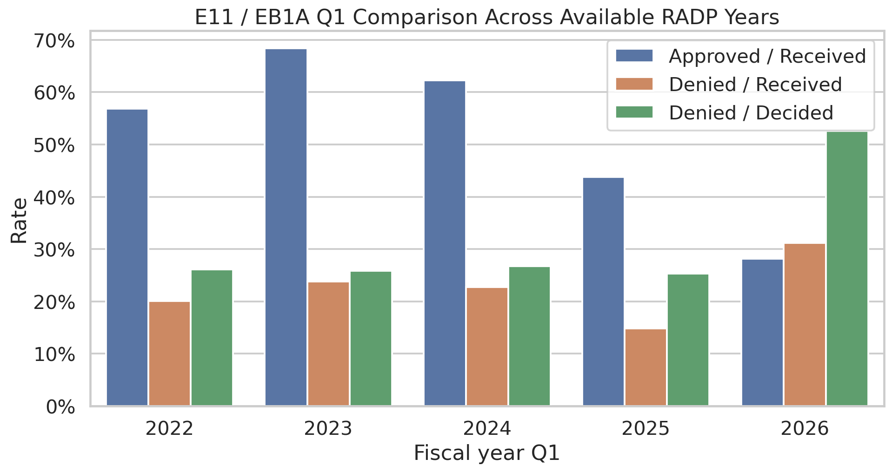

# USCIS I-140 EB1A / E11 Trend Analysis

This repository contains a local USCIS I-140 data project focused on employment-based petitions, especially EB1A / E11. It combines raw USCIS files, a PostgreSQL-oriented parsing pipeline, analysis-ready CSV exports, Jupyter notebooks, and an illustrated research report.

The core research question:

> Did the EB1A / E11 adjudication environment become materially less favorable in FY2025 and FY2026 Q1, and is recent pending inventory likely to resolve into denials at a higher rate than earlier periods?

## Main Finding

The evidence is directionally consistent with a worsening EB1A / E11 environment:

- E11 approval performance weakens materially in recent quarters.
- E11 pending inventory rises sharply through FY2025 and FY2026 Q1.
- FY2026 Q1 looks especially abnormal on a like-for-like Q1 comparison.
- Direct E11 cohort-level pending conversion is not observable in the current USCIS files.
- EB1 snapshot behavior is used as a cautious proxy for pending-resolution dynamics.

The strongest simple comparison is E11 Q1 across available RADP years:

| Fiscal year Q1 | Approval / received | Denial / received | Denial / decided |
|---:|---:|---:|---:|
| FY2022 Q1 | 56.8% | 20.1% | 26.1% |
| FY2023 Q1 | 68.4% | 23.8% | 25.8% |
| FY2024 Q1 | 62.2% | 22.7% | 26.7% |
| FY2025 Q1 | 43.8% | 14.8% | 25.3% |
| FY2026 Q1 | 28.1% | 31.1% | 52.5% |

FY2022-FY2025 Q1 denial/decided is relatively stable around 25-27%. FY2026 Q1 jumps to 52.5%, while approval/received falls to 28.1%.

## Illustrated Report

Start here:

- [EB1A Illustrated Report - Markdown](EB1A_ILLUSTRATED_REPORT.md)
- [EB1A Illustrated Report - PDF](EB1A_ILLUSTRATED_REPORT.pdf)
- [Chart export pack](eb1a_research_exports/README.md)
- [E11/NIW pending-outcome forecast notebook](eb1a_niw_pending_forecast.ipynb)

Key chart:



## Data Sources

The data was collected manually from local USCIS files saved under:

- `data/raw/raw_by_hands/`

The project no longer depends on live scraping of the USCIS website. Local raw files include XLSX, CSV, and PDF sources from FY2017-FY2026, with the most important analysis-ready coverage beginning in FY2022 for detailed E11/NIW RADP-style rows.

Important analysis tables:

- `data/analysis_tables/i140_quarterly_totals.csv`
  - General quarterly I-140 totals.
  - Coverage: FY2017-FY2025.
- `data/analysis_tables/eb1eb2_total_radp.csv`
  - Quarterly `TOTAL`, `EB1`, `E11`, `EB2`, `NIW`.
  - Coverage: FY2022-FY2026 Q1.
  - Main table for EB1A / E11 trend analysis.
- `data/analysis_tables/i140_yearly_total_eb1_eb2_snapshots.csv`
  - Yearly `TOTAL`, `EB1`, `EB2`.
  - Coverage: FY2009-FY2026.
  - Used for longer historical context and EB1 proxy analysis.

## Repository Structure

```text
.
├── data/
│   ├── raw/                  # manually collected USCIS source files
│   ├── staging/              # parser staging outputs
│   ├── exports/              # PostgreSQL table/view exports
│   └── analysis_tables/      # analysis-ready CSV tables
├── eb1a_research_exports/    # exported PNG charts and chart guide
├── scripts/                  # pipeline/report/export scripts
├── sql/                      # PostgreSQL schema and seed scripts
├── src/                      # parser/pipeline code
├── eb1a_trend_analysis.ipynb # main EB1A/E11 analysis notebook
├── eb1a_niw_pending_forecast.ipynb # pending maturation, tests, and forecast index
├── uscis_analysis_workbook.ipynb
├── EB1A_ILLUSTRATED_REPORT.md
├── EB1A_ILLUSTRATED_REPORT.pdf
├── DATABASE_SCHEMA.md
└── DATA_QUALITY_NOTES.md
```

## Method Summary

The analysis separates three different concepts:

1. `received basis`
   - `approved / received`
   - `denied / received`
   - Useful for workload and fresh-period pressure.

2. `decided basis`
   - `approved / (approved + denied)`
   - `denied / (approved + denied)`
   - More useful for adjudication severity because pending cases are excluded from the denominator.

3. `pending conversion proxy`
   - Direct E11 cohort-level pending conversion is not available.
   - EB1 current-status snapshot changes are used cautiously as a proxy.
   - EB1 is broader than E11 and includes E12/E13, so this is not exact EB1A tracking.

## Rebuild Key Outputs

Regenerate the chart export pack:

```powershell
python scripts\export_eb1a_research_package.py
```

Regenerate the illustrated Markdown/PDF report:

```powershell
python scripts\build_eb1a_illustrated_report.py
```

Run the local parser/pipeline:

```powershell
.\scripts\run_pipeline.ps1
```

Load staging data into PostgreSQL:

```powershell
.\scripts\run_psql.ps1 -SqlFile .\data\staging\latest_load.sql
```

## PostgreSQL Model

The database is organized into:

- `uscis_raw`
  - source files, workbook sheets, raw cells, corrections.
- `uscis_dim`
  - dimensions for forms, categories, countries, statuses, report families.
- `uscis_fact`
  - normalized fact tables such as `i140_status_counts` and `form_status_counts`.
- `uscis_mart`
  - analysis-ready views such as quarterly totals and EB1/EB2/E11/NIW mart tables.

See:

- [DATABASE_SCHEMA.md](DATABASE_SCHEMA.md)
- [DATA_QUALITY_NOTES.md](DATA_QUALITY_NOTES.md)

## Caveats

- FY2026 currently means FY2026 Q1 only.
- RFE status is not directly observed in the USCIS aggregate files.
- Pending is a stock/current-status measure, not a clean same-quarter flow.
- USCIS can revise historical counts across releases.
- EB1 is used as a proxy for pending conversion, but EB1 is not identical to E11.

## Project Status

This is an exploratory local research project. The next useful steps are:

- update the dataset after each new USCIS quarterly release;
- add confidence intervals around E11 rates;
- backtest the EB1 proxy forecast on older snapshots;
- build a dashboard over the analysis-ready CSV tables;
- compare EB1A/E11 with NIW and broader EB2 behavior.
